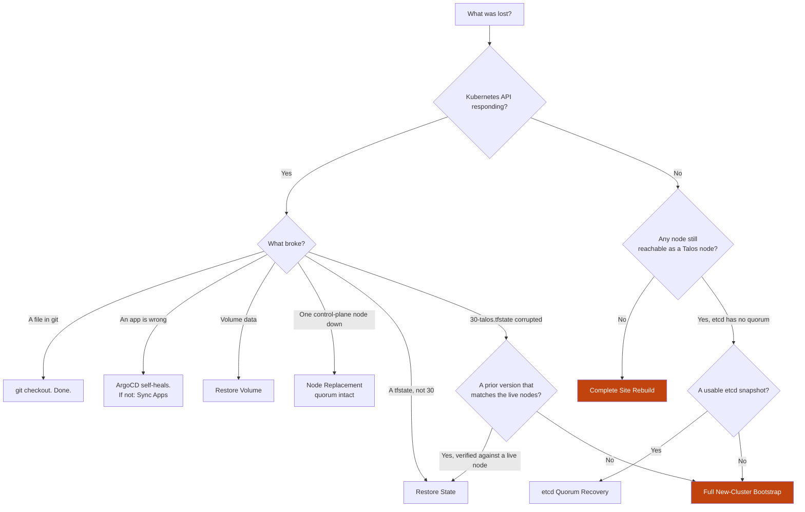

# Disaster Recovery

Recovery procedures. Start at the triage diagram, go to the named section, run the steps.

Everything under `terraform/` and `kubernetes/` rebuilds from this repo plus Key Vault.
Recovery is only ever about **state**, **data**, and the software that was never code.

**A layer-30 `terraform apply` is not a universal fix.** `talos_machine_secrets` generates
the cluster's root of trust exactly once; `talos_machine_bootstrap` runs exactly once,
against a single node. Neither reruns on a routine apply, and neither can be restored by
reapplying — one holds a value that exists only in state, the other is a one-shot action
Terraform already remembers as done. Losing one node, losing etcd quorum, and losing
`30-talos.tfstate` itself are three different failures with three different fixes, and
none of the three is "reapply layer 30 and see what happens." [Talos Recovery
Paths](#talos-recovery-paths) names all three plus the case where there is no cluster left
to recover into.

## Triage



One node down still leaves the Kubernetes API answering through the VIP — that is what
puts Node Replacement on the "Yes" side. Losing etcd quorum takes the API down with it,
which is what puts both remaining Talos paths on the "No" side alongside a total loss.

`30-talos.tfstate` gets one extra branch even on the "Yes" side: unlike every other layer's
state, a corrupted copy is worth checking against a **live node** before treating it as
lost — see [Restore State](#restore-state) and [Full New-Cluster
Bootstrap](#full-new-cluster-bootstrap) for why that check matters here specifically.

## Before you start

| Need | Why |
|---|---|
| `az login` | Every layer's backend and secret lookups |
| A machine on **VLAN 10** | FW-003 (kube API), FW-003-talos (Talos API), FW-006 (router), PVE-FW-002/003 (Proxmox), LXC-FW-005 (SSH to the core-infra LXCs) permit admin access from that VLAN only. PVE runs `input_policy = DROP` — applying 20-proxmox from anywhere else locks out the API mid-apply |
| This repo | `git clone`, then `cd terraform/<layer>` per step |
| `ansible-core` ≥ 2.15 | Steps 3 and 10 of a full rebuild (`core_infra.md`, `azdo_agents.md`) |
| `kubectl` | Verifying steps 5 and 9, and step 10 reads the deployer token through it |
| `talosctl` matching the *current* Talos minor | Every command in [Talos Recovery Paths](#talos-recovery-paths); the client is forward-compatible one minor, not backwards (`upgrades.md`) |

---

## Break-Glass

Admin access to a **running** cluster whose state is gone or untrusted. Needed for [Full
New-Cluster Bootstrap](#full-new-cluster-bootstrap) and [Complete Site
Rebuild](#complete-site-rebuild) — anywhere the fix starts by draining or backing up a
cluster you are about to disassemble. Node Replacement and etcd Quorum Recovery leave
`30-talos.tfstate` untouched, so `terraform -chdir=terraform/30-talos output -raw
talosconfig` (or `kubeconfig`) from that state is enough; reach for Key Vault only from a
workstation that does not have the state locally.

```bash
az keyvault secret show --vault-name rj-london --name talos-talosconfig --query value -o tsv > talosconfig
```

```bash
az keyvault secret show --vault-name rj-london --name talos-kubeconfig --query value -o tsv > kubeconfig
```

These do not replace the machine secrets: Terraform still cannot manage the cluster and no
new node can join. They buy you an orderly shutdown, not a repair.

## Restore State

For any layer whose `.tfstate` was corrupted or deleted — including 30-talos, with one
extra check.

List versions, then promote one:

```bash
az storage blob list --account-name rjterraform --container-name london --prefix <LAYER>.tfstate --include v --auth-mode login --query "[].{ver:versionId,time:properties.lastModified}" -o table
```

```bash
az storage blob copy start --account-name rjterraform --destination-container london --destination-blob <LAYER>.tfstate --source-uri "https://rjterraform.blob.core.windows.net/london/<LAYER>.tfstate?versionId=<VERSION_ID>" --auth-mode login
```

Then `terraform plan` and **read it**. A rolled-back state has forgotten resources that
still exist; the plan will offer to create them again.

If no version survives, `terraform import` each resource — works for 10, 20, 40, 50, 60.
**It does not work for 30.** `talos_machine_secrets` holds generated key material that
exists nowhere else — not on the node, not in any Talos API response — so there is nothing
to import it from. A rolled-back *version* of `30-talos.tfstate` can still be correct,
because the version itself contains the original secrets; an *import* can never be,
because import needs a live source of truth to read from and this resource has none. That
distinction is the whole reason 30-talos gets its own triage branch:

1. Roll back to the newest surviving version, as above.
2. Verify it against a live node before trusting it — a version can be stale as easily as
   the working copy was corrupted:
   ```bash
   terraform -chdir=terraform/30-talos output -raw talosconfig > talosconfig
   talosctl --talosconfig talosconfig -n 10.1.11.11 version
   ```
   A response means the recovered secrets match what the node was actually configured
   with. An authentication error means they do not — stop, do not keep trying older
   versions against a live cluster, and treat this as [Full New-Cluster
   Bootstrap](#full-new-cluster-bootstrap) instead.
3. No version at all: same redirect, immediately.

> Blob versioning must already be enabled for this to work. See
> [State backend hardening](#state-backend-hardening).

## Restore Volume

Longhorn UI → Backup → select volume → Restore. Backup target is the NFSv4 export on PBS
(`10.0.10.3`); the network path is FW-016 + PVE-FW-007.

Restore before the consuming app syncs, or it starts against an empty PVC.

## Sync Apps

```bash
kubectl --kubeconfig kubeconfig -n argocd get applications
```

Every row must read `Synced` / `Healthy`.

The expected set is `root` plus one Application per entry in the app registry,
`../../kubernetes/bootstrap/values.yaml` — the registry is the source of truth and is
deliberately not restated here. Entries with `onlyEdgeMode` render only in that edge mode,
so in dnat mode `cloudflared` is absent and that is correct. To list what should be there:

```bash
grep '^  - name: ' kubernetes/bootstrap/values.yaml
```

Common failures:

| Symptom | Cause |
|---|---|
| A wave stalls, later waves never start | Waves are strictly ordered — fix the earliest failure only |
| Everything blocked, admission errors cluster-wide | Kyverno is fail-closed. A stalled wave −2 blocks the whole cluster |
| `ComparisonError` naming project `homelab` | A chart now renders a cluster-scoped kind missing from `clusterResourceWhitelist` in `terraform/60-argo-cd/gitops.tf` |

Run this after [etcd Quorum Recovery](#etcd-quorum-recovery-snapshot-restore) too, not only
after a fresh bootstrap — a restored snapshot rolls every object in the API back to the
snapshot's age, and ArgoCD's `selfHeal` is what brings them back in line with git.

---

## Talos Recovery Paths

Three failures, three fixes, chosen by what is actually still alive — never by how much of
the cluster looks broken from the outside. Run the check in each path's **Entry condition**
before doing anything else; guessing which path applies from symptoms alone is exactly the
ambiguity this section exists to remove.

| Symptom | Control-plane nodes down | 30-talos.tfstate | Path |
|---|---|---|---|
| API answers via the VIP, one node unreachable | 1 of 3 | Intact | [Node Replacement](#node-replacement-quorum-intact) |
| API down, etcd reports no quorum | 2 or 3 of 3 | Intact | [etcd Quorum Recovery](#etcd-quorum-recovery-snapshot-restore) |
| Nodes alive but Talos will not accept the existing machine secrets | Any | Lost, or no version matches the live nodes | [Full New-Cluster Bootstrap](#full-new-cluster-bootstrap) |
| No node VM answers at all | 3 of 3 | Irrelevant | [Complete Site Rebuild](#complete-site-rebuild) |

Every path below states its **Terraform state** handling explicitly. Only one of the three
ever runs `terraform state rm` or generates new `talos_machine_secrets`, and it is the one
where the alternative has already been ruled out by the check above.

### Node Replacement (quorum intact)

**Entry condition:** exactly one control-plane node is unreachable. The other two still
form a quorum:
```bash
talosctl --talosconfig talosconfig -n 10.1.11.12,10.1.11.13 etcd status
```
reports a healthy leader and 2 of 3 members. `30-talos.tfstate` is intact.

**Terraform state:** untouched. The replacement VM reuses the existing
`talos_machine_configuration_apply.node["<name>"]` resource already in state — Terraform
re-applies the *same* config it already holds for that name to a blank Talos install. That
is why this is one of the two paths where a plain, untargeted apply is correct rather than
`-target`: the two healthy nodes see no diff (nothing about their config changed) and only
the replaced node has anything to converge, so there is no risk of the concurrent-reboot
problem `upgrades.md` guards against with `-target`.

**Credentials:** none beyond what's already local — see [Break-Glass](#break-glass).

**CNI:** none. Cilium is already running on the two healthy nodes; the replacement joins
the existing DaemonSet like any node join, not a fresh CNI install.

**Data restore order:** Longhorn re-replicates from the two survivors automatically — no
restore action. PostgreSQL is the exception, below.

**Destructive checkpoint:** none — the two healthy nodes and their data are never touched.

**Abort if:** a second control-plane node drops reachability while this is in progress.
Stop before applying anything further and re-triage as [etcd Quorum
Recovery](#etcd-quorum-recovery-snapshot-restore) — quorum math changes from "tolerates
one more loss" to "already lost" the moment that happens.

**Procedure:**

```bash
cd terraform/20-proxmox && terraform apply
```

```bash
cd terraform/30-talos && terraform apply
```

Longhorn re-replicates from the surviving two. No data loss.

PostgreSQL is the exception to that sentence: its volumes are single-replica and pinned to
their own node (`databases.md`), so there is nothing for Longhorn to re-replicate. The
operator promotes a standby — no data loss, one synchronous standby having confirmed every
commit — and the lost instance is recovered by deleting both its pod and its PVC, so the
operator re-clones it from the new primary:

```bash
kubectl cnpg destroy postgres <n> --kubeconfig kubeconfig -n databases
```

Both, not just the PVC: the `pvc-protection` finalizer holds a PVC in `Terminating` for as
long as a pod references it, and the pod on a dead node is itself stuck `Terminating`. The
command above is the `kubectl cnpg` plugin, which deletes the pair; without the plugin it is
`delete pod --force` followed by `delete pvc`.

The StorageClass sets `reclaimPolicy: Retain`, so the old `PersistentVolume` outlives its
PVC either way. Nothing reclaims it: delete the PV and the Longhorn volume behind it once
the replacement instance is streaming.

The replacement node must reuse the failed node's name and IPs — the pod CIDR is a `/22` at
`/24` per node, capping the cluster at 4, so a node added alongside rather than replacing
will not fit for long.

If the dead node still holds a stale etcd membership (it went down without leaving
gracefully — a crash or a hardware fault, rather than `talosctl reset`), the replacement
joins as a *new* member alongside a *phantom* one unless the stale entry is cleared first:

```bash
talosctl --talosconfig talosconfig -n 10.1.11.12 etcd members
```

```bash
talosctl --talosconfig talosconfig -n 10.1.11.12 etcd remove-member <member-id-of-dead-node>
```

Do this before the `30-talos` apply above rejoins the replacement, or the cluster ends up
with four registered members and three live ones.

### etcd Quorum Recovery (snapshot restore)

**Entry condition:** two or three control-plane nodes lost reachability at the same time
(simultaneous host failure, a power event). No node answers `etcd status` with a quorum, or
none answer at all. At least one node still carries its original Talos install — its STATE
partition, and with it the machine config and certificates 30-talos already applied — or a
usable etcd snapshot exists to recover onto a node that has been freshly reset.
`30-talos.tfstate` is intact and is not touched by anything in this path.

```bash
talosctl --talosconfig talosconfig -n 10.1.11.11,10.1.11.12,10.1.11.13 etcd status
```

**No periodic snapshot exists today.** Nothing in this repo schedules `talosctl etcd
snapshot` (`manual_work_inventory.md`, Automation backlog #6). The only snapshot available
during an incident is one taken in the moment, from whichever node still answers, before
anything else changes — the same "grab it while it's still reachable" logic as the
Postgres dump called out under [Full New-Cluster
Bootstrap](#full-new-cluster-bootstrap):

```bash
talosctl --talosconfig talosconfig -n 10.1.11.11 etcd snapshot db.snapshot
```

**Terraform state:** untouched throughout. This entire path is `talosctl` against live
nodes; Terraform's only role is a post-recovery `terraform plan` on 30-talos to confirm no
drift, which should show nothing, since no node's STATE partition or machine config was
ever touched. **No `terraform apply` appears in this path.** If reaching for one feels like
the fix, that is a sign the wrong path was chosen — machine config was never the problem,
etcd data was.

**Credentials:** none beyond what's already local — see [Break-Glass](#break-glass).

**CNI:** none re-provisioned. Cilium's agent pods keep running on any node that was not
reset; on a node whose EPHEMERAL partition was wiped, the DaemonSet pod restarts and
reconciles against the restored API on its own once kubelet rejoins. Verify rather than
reinstall:

```bash
kubectl --kubeconfig kubeconfig get pods -n kube-system -l k8s-app=cilium
```

**Data restore order:** the snapshot brings the Kubernetes API back to the moment it was
taken — everything created or changed after that moment is gone from etcd, whether or not
its underlying data still exists on disk. In order:

1. etcd healthy, Kubernetes API answering (below).
2. [Sync Apps](#sync-apps) — ArgoCD itself is one of the restored objects; give it a
   moment to become healthy, then let `selfHeal` bring every Application back in line with
   git.
3. Longhorn reconciles its volume/replica custom resources against what is actually on
   disk. If the snapshot is older than a volume's true state, Longhorn can believe a
   healthy replica is missing — check the Longhorn UI before trusting any PVC; a volume
   stuck degraded when its data is intact needs a manual salvage, not a restore.
4. PostgreSQL last. CloudNativePG's `Cluster` status is one more object that just rolled
   back, but the actual data and replication state live in the instances themselves.
   Confirm the operator's view matches reality before trusting it to reconcile
   automatically:
   ```bash
   kubectl cnpg status postgres --kubeconfig kubeconfig -n databases
   ```
   A primary that disagrees with which instance is actually current means the snapshot
   predates a completed switchover — fix the label by hand rather than let the operator
   act on stale status.

**Destructive checkpoint:** `talosctl reset --system-labels-to-wipe=EPHEMERAL` on any node
that must rejoin fresh. This wipes that node's etcd data and kubelet state (not its Talos
identity or machine config) and cannot be undone — take the snapshot above first, on
whichever node is healthiest, before resetting anything.

**Abort if:** no snapshot can be taken or located, and no node's local etcd data is usable
either (`bootstrap --recover-from` reports a hash-check failure and no older snapshot
exists to try `--recover-skip-hash-check` against). There is no partial version of this
path — either a snapshot recovers the cluster's data, or the data is gone and the only
remaining move is [Full New-Cluster Bootstrap](#full-new-cluster-bootstrap), which recovers
the *cluster* but not what was in it.

**Procedure**, once a snapshot is in hand:

Reset every node that is not the recovery target — nodes that are up but whose etcd will
not rejoin the others, or that were part of the lost majority:

```bash
talosctl --talosconfig talosconfig -n 10.1.11.12 reset --graceful=false --reboot --system-labels-to-wipe=EPHEMERAL
```

Recover onto one node, chosen as the new single-member seed:

```bash
talosctl --talosconfig talosconfig -n 10.1.11.11 bootstrap --recover-from=./db.snapshot
```

Add `--recover-skip-hash-check` only for a snapshot copied directly out of the etcd data
directory rather than produced by `etcd snapshot` above — that flag exists because a raw
copy carries no checksum to verify against.

Wait for that node's etcd to report healthy as a single member, then reset and rejoin the
remaining nodes the same way — their STATE partition and machine config survive the
EPHEMERAL wipe, so they rejoin using the identity 30-talos already gave them:

```bash
talosctl --talosconfig talosconfig -n 10.1.11.11 health --server=false
```

```bash
talosctl --talosconfig talosconfig -n 10.1.11.13 reset --graceful=false --reboot --system-labels-to-wipe=EPHEMERAL
```

Then [Sync Apps](#sync-apps), followed by the data restore order above.

### Full New-Cluster Bootstrap

**Entry condition:** `30-talos.tfstate` is lost, or the [Restore State](#restore-state)
check above found no version whose secrets authenticate against a live node. The node VMs
themselves are still there — this is a lost *identity*, not a lost *site*.

**Terraform state:** this is the one path that replaces state, and it is not a shortcut —
it is the acknowledged consequence of losing the one resource with no import path.
`talos_machine_secrets` is generated once by the provider and stored nowhere but this
state file; a version that does not match the live nodes cannot be repaired, only
discarded. If a corrupted file still exists at the backend key, remove every resource it
holds explicitly:

```bash
cd terraform/30-talos && terraform state rm talos_machine_secrets.this
```

(and the rest of that layer's resources the same way) so that `terraform state list`
returns nothing before proceeding. Then:

```bash
cd terraform/30-talos && terraform apply
```

against that empty state generates brand-new `talos_machine_secrets` — a new cluster CA.
Same VM names, same IPs, new identity. Nothing here is a "restore."

**Credentials:** Break-Glass, before touching anything else. The old cluster is still
running under its old identity right up until the first `talosctl reset` below —
Key Vault's `talos-talosconfig`/`talos-kubeconfig` are how you reach it to drain workloads
and take a final backup pass, since the local `terraform output` for this layer no longer
matches (or no longer exists for) that running cluster.

**CNI:** full reinstall. A wiped node comes back with `cni: none` until 40-kube-networking
applies Cilium — apply 30 and 40 back-to-back, exactly as in [Complete Site
Rebuild](#complete-site-rebuild) steps 4–5.

**Data restore order:** Longhorn volumes from the backup target ([Restore
Volume](#restore-volume)), after 40-kube-networking reinstalls Longhorn and before the
consuming app's first sync creates an empty PVC. PostgreSQL has no backup today
(`databases.md`), so it comes back empty — nothing in this repo restores it. Technitium
zone data is a config-backup restore independent of this layer entirely (`core_infra.md`).

**Destructive checkpoint:** the node VMs are, at this moment, the only surviving copy of
whatever Longhorn and PostgreSQL data exists. Before the first `talosctl reset`:

```bash
kubectl cnpg status postgres --kubeconfig kubeconfig -n databases
pg_dump -h <postgres-rw-ip> -U app -d app > app.sql
```

(reachable through the break-glass kubeconfig above) and let any in-progress Longhorn
backup jobs finish. After the reset, there is no undo — the disk holding that data is
about to be reinstalled.

**Abort if:** the node VMs themselves turn out to be gone, not just their Talos identity —
that is [Complete Site Rebuild](#complete-site-rebuild), which also rebuilds 20-proxmox and
everything under it. Conversely, if a working prior version of `30-talos.tfstate` surfaces
*before* the first `talosctl reset` — stop, verify it per [Restore State](#restore-state)
instead; it is strictly cheaper than what follows.

**Procedure:**

```bash
talosctl --talosconfig talosconfig -n 10.1.11.11,10.1.11.12,10.1.11.13 reset --graceful=false --reboot
```

```bash
cd terraform/30-talos && terraform apply
```

```bash
cd terraform/40-kube-networking && terraform apply
```

Continue from **step 6** of [Complete Site Rebuild](#complete-site-rebuild) — Longhorn
target reconnect, then 50-cloudflare and 60-argo-cd unchanged.

---

## Complete Site Rebuild

**Entry condition:** no node VM answers at all — the Proxmox hosts, the site, or enough
hardware is gone that nothing survives to recover onto. Everything downstream of layer 10
is being rebuilt from this repo plus Key Vault, not recovered from a running state.

**Terraform state:** every layer's state is rebuilt fresh, in dependency order. 30-talos
generates new `talos_machine_secrets` exactly as in [Full New-Cluster
Bootstrap](#full-new-cluster-bootstrap), for the same reason — there is nothing surviving
to preserve it against.

**Credentials:** none of the running-cluster break-glass secrets apply — there is no
running cluster. Key Vault itself must already survive this (`documentation/secrets.md`);
every other secret this rebuild needs is listed per-step below.

**CNI:** full reinstall, same as [Full New-Cluster
Bootstrap](#full-new-cluster-bootstrap) — layer 40 applies Cilium immediately after layer
30 bootstraps (steps 4–5 below), since every node starts with `cni: none`.

**Data restore order:** Longhorn volumes after step 6 below, before the consuming app's
first sync ([Restore Volume](#restore-volume)); Technitium zone data alongside step 3
(`core_infra.md`); PostgreSQL has no backup today, so step 9 brings it back empty
(`databases.md`).

**Destructive checkpoint:** none additional — there is nothing surviving to back up first.

**Abort if:** any node VM turns out to still be reachable after all. That is not a site
loss — re-triage into [Full New-Cluster Bootstrap](#full-new-cluster-bootstrap) or
[Node Replacement](#node-replacement-quorum-intact), both of which spare layer 10, layer 20,
and core-infra DNS.

```mermaid
flowchart LR
    P[0. Physical<br/>+ UniFi bootstrap] --> N[1. 10-network]
    N --> X[2. 20-proxmox]
    X --> M[3. core-infra DNS<br/>ansible + manual chrony]
    M --> T[4. 30-talos]
    T --> K[5. 40-kube-net]
    K --> L[6. Longhorn target<br/>MANUAL]
    L --> C[7. 50-cloudflare]
    C --> A[8. 60-argo-cd]
    A --> G[9. ArgoCD converges]
    G --> Z[10. azdo agents<br/>ansible]

    style M fill:#c1440e,color:#fff
    style L fill:#c1440e,color:#fff
    style Z fill:#c1440e,color:#fff
    style T fill:#1f6f8b,color:#fff
    style K fill:#1f6f8b,color:#fff
```



Steps 4 and 5 run **back to back**. Layer 30 finishes at the pre-CNI health gate after
Talos, the Kubernetes API, and etcd are healthy; Kubernetes node readiness is deliberately
deferred. Layer 40 installs Cilium, then its post-Cilium health gate requires the Kubernetes
checks to pass before the remaining networking resources continue.

| # | Layer | Key Vault secrets needed first | Verify before continuing |
|---|---|---|---|
| 0 | Physical + UniFi | `unifi-password`, `wlan-passphrase-home{,-iot,-mgmt}` | See `../networking/physical_network.md` "Bootstrap" |
| 1 | `10-network` | *(above)* | Switch on `10.0.10.2`, AP on `10.0.10.6`, 3 SSIDs up |
| 2 | `20-proxmox` | `proxmox-api-token` | 3 VMs + 4 LXCs running |
| 3 | **core-infra DNS** — `ansible/` | `technitium-admin-password`, `public-domain` | `dig @10.0.10.4` and `@10.0.10.5` answer |
| 4 | `30-talos` | — *(writes 2)* | Pre-CNI health gate passes: Talos, the Kubernetes API, and etcd are healthy; nodes exist and are **NotReady** — correct, no CNI yet |
| 5 | `40-kube-networking` | `public-domain`, `acme-email` | Post-Cilium health gate passes with all 3 nodes Ready; the three `platform-*` PriorityClasses exist; both Traefik Services hold their LB IPs. The wildcard cert is **Pending** — correct, see below |
| 6 | **Longhorn target — manual** | — | Backup target connected; volumes restored |
| 7 | `50-cloudflare` | `cert-manager--cloudflare-dns-api-token`, `cloudflare-account-id`, `public-domain` | Tunnel healthy; `cloudflared--tunnel-token` written |
| 8 | `60-argo-cd` | `argocd-admin-password-bcrypt`, `azure-kv-sp-client-id`, `azure-kv-sp-client-secret`, `public-domain` | ArgoCD UI reachable over the wildcard cert once step 9 has issued it |
| 9 | *(unattended)* | — | See [Sync Apps](#sync-apps), then the wildcard cert reaches `Ready` |
| 10 | **Azure DevOps agents** — `ansible/` | `azdo-pat`, `azdo-org-url`, `talos-kubeconfig` | Both agents Online in the pool; `kubectl auth can-i` from each LXC answers `yes` |

Each layer is `cd terraform/<layer> && terraform init && terraform apply`.

### Step traps

- **Step 2** — `storage.tf` imports the `local` datastore and its `content` list *replaces*
  live config. Check `pvesm status` first. Talos VMs must not get qemu-guest-agent; enabling
  it hangs the apply.
- **Step 3** — LXCs have no cloud-init, so nothing configures a container's contents at
  create time. Technitium (primary `.4`, secondary `.5`) is `cd ansible && ansible-playbook
  core-infra.yml`; chrony is still by hand. **Not optional and not deferrable:** FW-001/002
  block every public resolver and NTP pool, so nodes booted before this exists never
  converge. The playbook recreates the zones and the records it manages
  (`core_infra.md`) — anything added through the web console comes back only from
  Technitium's own backup.
- **Step 4** — this is [Full New-Cluster Bootstrap](#full-new-cluster-bootstrap) with no
  prior identity to reset first: an empty 30-talos state generates new
  `talos_machine_secrets` the moment it applies, so there is nothing extra to do here that
  path doesn't already cover.
- **Step 5** — on state predating the backend key rename, `terraform init -migrate-state`
  once. A plain `-reconfigure` starts from empty state and re-creates the layer. This layer
  also creates the `platform-*` PriorityClasses (`scheduling.tf`), which every later step
  depends on: a pod naming a class that does not exist is rejected at admission, so a
  partial step 5 makes step 8 fail with ArgoCD's pods stuck unschedulable rather than with
  anything naming the real cause.

  ```bash
  kubectl get priorityclass platform-critical platform-observability platform-bulk
  ```
- **Steps 5 → 9, certificates** — the `letsencrypt` ClusterIssuer's DNS-01 solver reads a
  Cloudflare token that External Secrets Operator syncs, and ESO does not exist until step 8
  brings up ArgoCD. So the wildcard `Certificate`s sit `Pending` from step 5 until wave −1 of
  step 9, and both Traefik instances serve their built-in self-signed certificate in the
  meantime. This is the designed sequence, not a fault: it is what keeps the token out of
  40-kube-networking's state. Nothing needs doing — issuance completes unattended once ESO
  syncs. If it has not after ArgoCD is `Synced`/`Healthy`, check the ExternalSecret in
  `cert-manager` before the Certificate.

  In that same window the `lan-fallback` route fails too: its second hop verifies the
  external instance's certificate against the apex, and a self-signed one does not validate.
  So LAN access to `traefik-external` apps returns 502 until the wildcard issues, on top of
  the browser warning internal apps show. Both clear together at wave −1 of step 9, and
  neither is worth chasing before then.
- **Step 9** — the PostgreSQL cluster comes back empty. It has no backups (`databases.md`),
  so nothing in this runbook restores it; the apps that depend on it come up against a fresh
  database.
- **Step 10** — the containers have been running since step 2 and idle since; only the
  software inside them is new here. It cannot move earlier: the `azdo-deployer` ServiceAccount
  and its token are GitOps objects at wave 2, so they do not exist until step 9. The token
  `Secret` is filled in by the token controller rather than by ArgoCD, so a run started the
  moment the app reports `Synced` can read it back empty — the play asserts on that instead of
  templating an empty credential. `config.sh` runs with `--replace`, so a rebuilt container
  reclaims its own name in the pool; without it the registration is refused as a duplicate and
  the fix is deleting the stale agent in the Azure DevOps UI. Nothing else in the rebuild
  depends on this step, so a failure here costs pipelines and nothing more.

---

## Prevention

The three things that must already be true before any of the above works.

### State backend hardening

Storage account `rjterraform` / RG `terraform` / container `london`. Run once:

```bash
az storage account blob-service-properties update --account-name rjterraform --resource-group terraform --enable-versioning true --enable-delete-retention true --delete-retention-days 30 --enable-container-delete-retention true --container-delete-retention-days 30
```

```bash
az lock create --name state-no-delete --lock-type CanNotDelete --resource-group terraform --resource rjterraform --resource-type Microsoft.Storage/storageAccounts
```

Without versioning, [Restore State](#restore-state) has nothing to restore from — and for
30-talos specifically, versioning is the *only* thing that can make [Full New-Cluster
Bootstrap](#full-new-cluster-bootstrap) unnecessary, since it is the one layer with no
import fallback behind it.

### Backups of what code cannot rebuild

| Data | Backed up by |
|---|---|
| Longhorn volumes | Longhorn backup target → NFSv4 on PBS |
| etcd (Talos cluster state) | **nothing scheduled** — `talosctl etcd snapshot` exists only if taken ad hoc during an incident (`manual_work_inventory.md`, Automation backlog #6) |
| PostgreSQL | **nothing** — the cluster is replicated, not backed up (`databases.md`) |
| VM/CT system disks | PBS jobs (Longhorn data disks excluded — `../networking/allocations.md`) |
| Technitium zones + blocklists | `ansible/` for the managed set; Technitium config backup for the rest |
| Azure DevOps agent registration | **nothing, deliberately** — `ansible/azdo-agent.yml` re-registers with `--replace` |
| UniFi controller config | Controller auto-backup (System > Backups) |
| **The PBS datastore itself** | Off-site PBS sync or encrypted `rclone` push |
| Key Vault | Soft-delete + purge protection |

PBS sits in the same room on the same power as everything it protects. The off-site copy is
what makes it a backup.

### Rehearsal

An untested runbook is a guess. Twice a year: restore one Longhorn volume to a scratch PVC,
roll one non-30 layer's state back a version and confirm `terraform plan` reads clean, and
run [Node Replacement](#node-replacement-quorum-intact) against one node in a scratch
environment or maintenance window. Once a year, additionally rehearse [etcd Quorum
Recovery](#etcd-quorum-recovery-snapshot-restore) end to end with an ad hoc snapshot — the
one path here that has never run for real is the one most likely to have a wrong command in
it (`manual_work_inventory.md`, "Perform etcd... restore drills").
