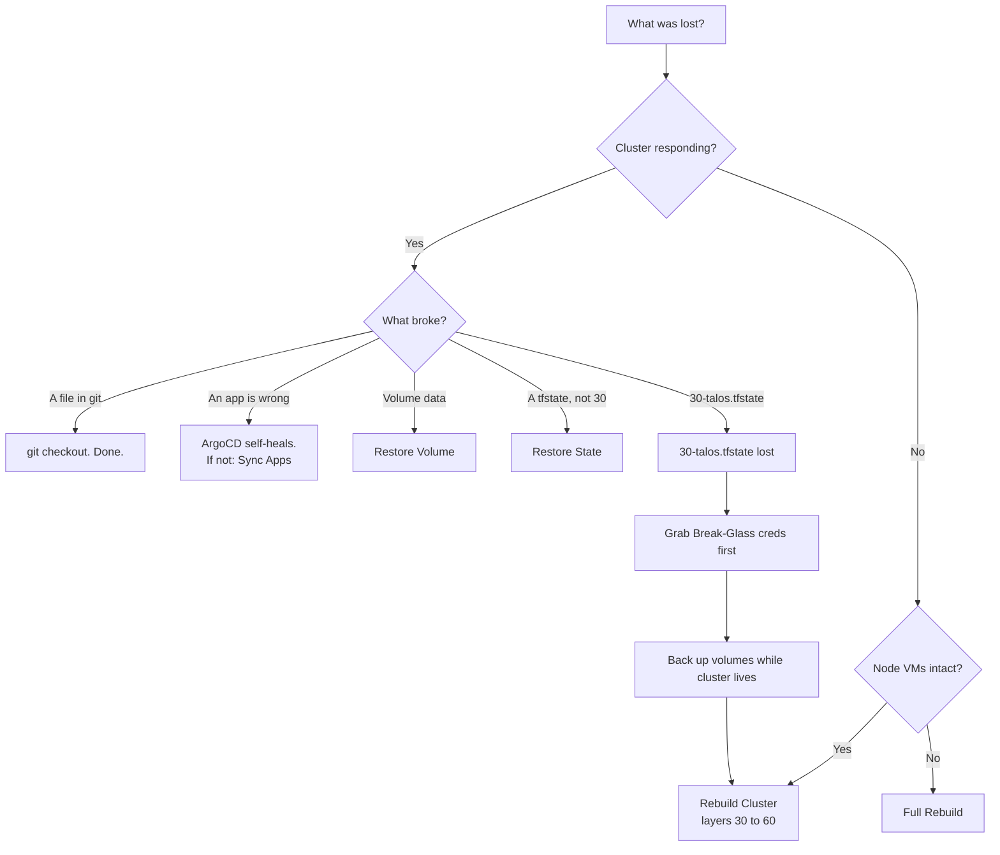

# Disaster Recovery

Recovery procedures. Start at the triage diagram, go to the named section, run the steps.

Everything under `terraform/` and `kubernetes/` rebuilds from this repo plus Key Vault.
Recovery is only ever about **state**, **data**, and the software that was never code.

## Triage



**`30-talos.tfstate` is the only irreplaceable file.** It holds the Talos machine secrets —
the cluster CA. They cannot be regenerated or read back off a running node. The cluster
keeps running, but nothing can administer or re-apply to it, so the fix is always a
rebuild of layers 30→60. Everything else has a path back.

## Before you start

| Need | Why |
|---|---|
| `az login` | Every layer's backend and secret lookups |
| A machine on **VLAN 10** | FW-003 (kube API), FW-003-talos (Talos API), FW-006 (router), PVE-FW-002/003 (Proxmox) permit admin access from that VLAN only. PVE runs `input_policy = DROP` — applying 20-proxmox from anywhere else locks out the API mid-apply |
| This repo | `git clone`, then `cd terraform/<layer>` per step |

---

## Break-Glass

Admin access to a **running** cluster whose state is gone. Get these first, before touching
anything else — they let you drain workloads and take a final volume backup.

```bash
az keyvault secret show --vault-name rj-london --name talos-talosconfig --query value -o tsv > talosconfig
```

```bash
az keyvault secret show --vault-name rj-london --name talos-kubeconfig --query value -o tsv > kubeconfig
```

These do not replace the machine secrets: Terraform still cannot manage the cluster and no
new node can join. They buy you an orderly shutdown, not a repair.

## Restore State

For any layer whose `.tfstate` was corrupted or deleted. Not 30-talos — see the triage note.

List versions, then promote one:

```bash
az storage blob list --account-name rjterraform --container-name london --prefix <LAYER>.tfstate --include v --auth-mode login --query "[].{ver:versionId,time:properties.lastModified}" -o table
```

```bash
az storage blob copy start --account-name rjterraform --destination-container london --destination-blob <LAYER>.tfstate --source-uri "https://rjterraform.blob.core.windows.net/london/<LAYER>.tfstate?versionId=<VERSION_ID>" --auth-mode login
```

Then `terraform plan` and **read it**. A rolled-back state has forgotten resources that
still exist; the plan will offer to create them again.

If no version survives, `terraform import` each resource — works for 10, 20, 40, 50, 60.

> Blob versioning must already be enabled for this to work. See
> [State backend hardening](#state-backend-hardening).

## Restore Volume

Longhorn UI → Backup → select volume → Restore. Backup target is the NFSv4 export on PBS
(`10.0.10.3`); the network path is FW-016 + PVE-FW-007.

Restore before the consuming app syncs, or it starts against an empty PVC.

## Sync Apps

```bash
kubectl --kubeconfig kubeconfig -n argocd get applications
```

Every row must read `Synced` / `Healthy`.

The expected set is `root` plus one Application per entry in the app registry,
`../../kubernetes/bootstrap/values.yaml` — the registry is the source of truth and is
deliberately not restated here. Entries with `onlyEdgeMode` render only in that edge mode,
so in dnat mode `cloudflared` is absent and that is correct. To list what should be there:

```bash
grep '^  - name: ' kubernetes/bootstrap/values.yaml
```

Common failures:

| Symptom | Cause |
|---|---|
| A wave stalls, later waves never start | Waves are strictly ordered — fix the earliest failure only |
| Everything blocked, admission errors cluster-wide | Kyverno is fail-closed. A stalled wave −2 blocks the whole cluster |
| `ComparisonError` naming project `homelab` | A chart now renders a cluster-scoped kind missing from `clusterResourceWhitelist` in `terraform/60-argo-cd/gitops.tf` |

---

## Rebuild Cluster

Node VMs are alive; the cluster is not. Layers 30→60.

```bash
cd terraform/30-talos && terraform apply
```

Then continue from **step 4** of the full rebuild below. Talos reinstall wipes the OS
disks, so Longhorn data does not survive — Restore Volume after step 5.

## Full Rebuild

```mermaid
flowchart LR
    P[0. Physical<br/>+ UniFi bootstrap] --> N[1. 10-network]
    N --> X[2. 20-proxmox]
    X --> M[3. DNS/NTP<br/>MANUAL]
    M --> T[4. 30-talos]
    T --> K[5. 40-kube-net]
    K --> L[6. Longhorn target<br/>MANUAL]
    L --> C[7. 50-cloudflare]
    C --> A[8. 60-argo-cd]
    A --> G[9. ArgoCD converges]

    style M fill:#c1440e,color:#fff
    style L fill:#c1440e,color:#fff
    style T fill:#1f6f8b,color:#fff
    style K fill:#1f6f8b,color:#fff
```



Steps 4 and 5 run **back to back** — between them the cluster looks broken by design.

| # | Layer | Key Vault secrets needed first | Verify before continuing |
|---|---|---|---|
| 0 | Physical + UniFi | `unifi-password`, `wlan-passphrase-home{,-iot,-mgmt}` | See `../networking/physical_network.md` "Bootstrap" |
| 1 | `10-network` | *(above)* | Switch on `10.0.10.2`, AP on `10.0.10.6`, 3 SSIDs up |
| 2 | `20-proxmox` | `proxmox-api-token` | 3 VMs + 2 LXCs running |
| 3 | **DNS/NTP — manual** | — | `dig @10.0.10.4` and `@10.0.10.5` answer |
| 4 | `30-talos` | — *(writes 2)* | Nodes exist and are **NotReady** — correct, no CNI yet |
| 5 | `40-kube-networking` | `cloudflare-dns-api-token`, `public-domain`, `acme-email` | All 3 nodes Ready; wildcard cert issued |
| 6 | **Longhorn target — manual** | — | Backup target connected; volumes restored |
| 7 | `50-cloudflare` | `cloudflare-dns-api-token`, `cloudflare-account-id`, `public-domain` | Tunnel healthy; `cloudflared--tunnel-token` written |
| 8 | `60-argo-cd` | `argocd-admin-password-bcrypt`, `azure-kv-sp-client-id`, `azure-kv-sp-client-secret`, `public-domain` | ArgoCD UI reachable |
| 9 | *(unattended)* | — | See [Sync Apps](#sync-apps) |

Each layer is `cd terraform/<layer> && terraform init && terraform apply`.

### Step traps

- **Step 2** — `storage.tf` imports the `local` datastore and its `content` list *replaces*
  live config. Check `pvesm status` first. Talos VMs must not get qemu-guest-agent; enabling
  it hangs the apply.
- **Step 3** — LXCs have no cloud-init, so Technitium (primary `.4`, secondary `.5`) and
  chrony are installed by hand. **Not optional and not deferrable:** FW-001/002 block every
  public resolver and NTP pool, so nodes booted before this exists never converge. Restore
  zones from Technitium's own backup.
- **Step 5** — on state predating the backend key rename, `terraform init -migrate-state`
  once. A plain `-reconfigure` starts from empty state and re-creates the layer.

## Single Node Lost

```bash
cd terraform/20-proxmox && terraform apply
```

```bash
cd terraform/30-talos && terraform apply
```

Longhorn re-replicates from the surviving two. No data loss. The replacement must reuse the
failed node's name and IPs — the pod CIDR is a `/22` at `/24` per node, capping the cluster
at 4, so a node added alongside rather than replacing will not fit for long.

---

## Prevention

The three things that must already be true before any of the above works.

### State backend hardening

Storage account `rjterraform` / RG `terraform` / container `london`. Run once:

```bash
az storage account blob-service-properties update --account-name rjterraform --resource-group terraform --enable-versioning true --enable-delete-retention true --delete-retention-days 30 --enable-container-delete-retention true --container-delete-retention-days 30
```

```bash
az lock create --name state-no-delete --lock-type CanNotDelete --resource-group terraform --resource rjterraform --resource-type Microsoft.Storage/storageAccounts
```

Without versioning, [Restore State](#restore-state) has nothing to restore from.

### Backups of what code cannot rebuild

| Data | Backed up by |
|---|---|
| Longhorn volumes | Longhorn backup target → NFSv4 on PBS |
| VM/CT system disks | PBS jobs (Longhorn data disks excluded — `../networking/allocations.md`) |
| Technitium zones + blocklists | Technitium config backup |
| UniFi controller config | Controller auto-backup (System > Backups) |
| **The PBS datastore itself** | Off-site PBS sync or encrypted `rclone` push |
| Key Vault | Soft-delete + purge protection |

PBS sits in the same room on the same power as everything it protects. The off-site copy is
what makes it a backup.

### Rehearsal

An untested runbook is a guess. Twice a year: restore one Longhorn volume to a scratch PVC,
and roll one non-30 layer's state back a version and confirm `terraform plan` reads clean.
