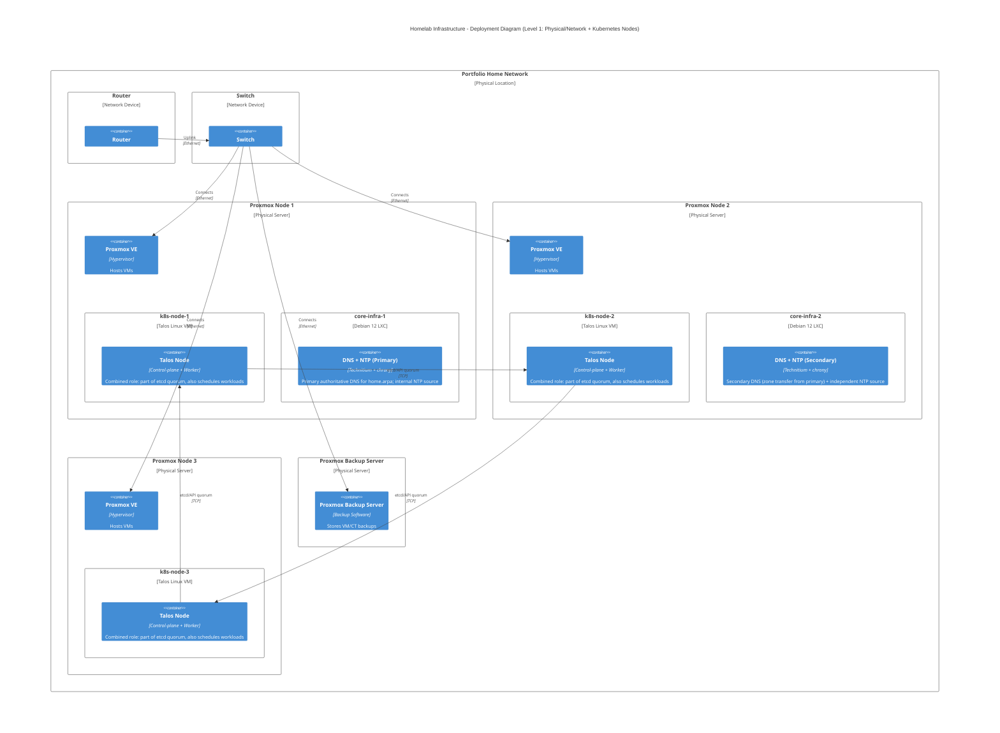

```mermaid
C4Deployment
title Homelab Infrastructure - Deployment Diagram (Level 1: Physical/Network + Kubernetes Nodes)

Deployment_Node(home, "Portfolio Home Network", "Physical Location"){

    Deployment_Node(router, "Router", "Network Device"){
        Container(router_c, "Router")
    }

    Deployment_Node(switch, "Switch", "Network Device"){
        Container(switch_c, "Switch")
    }

    Deployment_Node(pve1, "Proxmox Node 1", "Physical Server"){
        Container(pve1_hv, "Proxmox VE", "Hypervisor", "Hosts VMs")
        Deployment_Node(k8s1, "k8s-node-1", "Talos Linux VM"){
            Container(k8s1_c, "Talos Node", "Control-plane + Worker", "Combined role: part of etcd quorum, also schedules workloads")
        }
        Deployment_Node(core_infra1, "core-infra-1", "Debian 12 LXC"){
            Container(core_infra1_c, "DNS + NTP (Primary)", "Technitium + chrony", "Primary authoritative DNS for home.arpa; internal NTP source")
        }
    }

    Deployment_Node(pve2, "Proxmox Node 2", "Physical Server"){
        Container(pve2_hv, "Proxmox VE", "Hypervisor", "Hosts VMs")
        Deployment_Node(k8s2, "k8s-node-2", "Talos Linux VM"){
            Container(k8s2_c, "Talos Node", "Control-plane + Worker", "Combined role: part of etcd quorum, also schedules workloads")
        }
        Deployment_Node(core_infra2, "core-infra-2", "Debian 12 LXC"){
            Container(core_infra2_c, "DNS + NTP (Secondary)", "Technitium + chrony", "Secondary DNS (zone transfer from primary) + independent NTP source")
        }
    }

    Deployment_Node(pve3, "Proxmox Node 3", "Physical Server"){
        Container(pve3_hv, "Proxmox VE", "Hypervisor", "Hosts VMs")
        Deployment_Node(k8s3, "k8s-node-3", "Talos Linux VM"){
            Container(k8s3_c, "Talos Node", "Control-plane + Worker", "Combined role: part of etcd quorum, also schedules workloads")
        }
    }

    Deployment_Node(pbs, "Proxmox Backup Server", "Physical Server"){
        Container(pbs_sw, "Proxmox Backup Server", "Backup Software", "Stores VM/CT backups")
    }
}

Rel(router_c, switch_c, "Uplink", "Ethernet")
Rel(switch_c, pve1_hv, "Connects", "Ethernet")
Rel(switch_c, pve2_hv, "Connects", "Ethernet")
Rel(switch_c, pve3_hv, "Connects", "Ethernet")
Rel(switch_c, pbs_sw, "Connects", "Ethernet")

Rel(k8s1_c, k8s2_c, "etcd/API quorum", "TCP")
Rel(k8s2_c, k8s3_c, "etcd/API quorum", "TCP")
Rel(k8s3_c, k8s1_c, "etcd/API quorum", "TCP")

UpdateRelStyle(router_c, switch_c, $offsetY="-10")
```