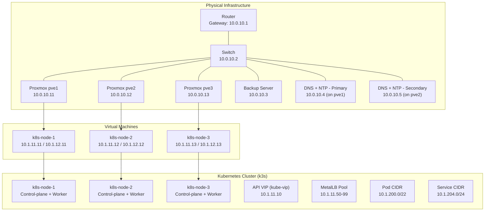

```mermaid
flowchart TB

    subgraph PHYSICAL["Physical Infrastructure"]
        ROUTER["Router<br/>Gateway: 10.0.10.1"]
        SWITCH["Switch<br/>10.0.10.2"]
        PVE1["Proxmox pve1<br/>10.0.10.11"]
        PVE2["Proxmox pve2<br/>10.0.10.12"]
        PVE3["Proxmox pve3<br/>10.0.10.13"]
        PBS["Backup Server<br/>10.0.10.3"]
        DNSNTP1["DNS + NTP - Primary<br/>10.0.10.4 (on pve1)"]
        DNSNTP2["DNS + NTP - Secondary<br/>10.0.10.5 (on pve2)"]

        ROUTER --- SWITCH
        SWITCH --- PVE1
        SWITCH --- PVE2
        SWITCH --- PVE3
        SWITCH --- PBS
        SWITCH --- DNSNTP1
        SWITCH --- DNSNTP2
    end

    subgraph VMS["Virtual Machines"]
        VM1["k8s-node-1<br/>10.1.11.11 / 10.1.12.11"]
        VM2["k8s-node-2<br/>10.1.11.12 / 10.1.12.12"]
        VM3["k8s-node-3<br/>10.1.11.13 / 10.1.12.13"]
    end

    subgraph K8S["Kubernetes Cluster (k3s)"]
        N1["k8s-node-1<br/>Control-plane + Worker"]
        N2["k8s-node-2<br/>Control-plane + Worker"]
        N3["k8s-node-3<br/>Control-plane + Worker"]
        VIP["API VIP (kube-vip)<br/>10.1.11.10"]
        LB["MetalLB Pool<br/>10.1.11.50-99"]
        PODCIDR["Pod CIDR<br/>10.1.200.0/22"]
        SVCCIDR["Service CIDR<br/>10.1.204.0/24"]
    end

    PVE1 --> VM1
    PVE2 --> VM2
    PVE3 --> VM3

    VM1 --> N1
    VM2 --> N2
    VM3 --> N3
```
