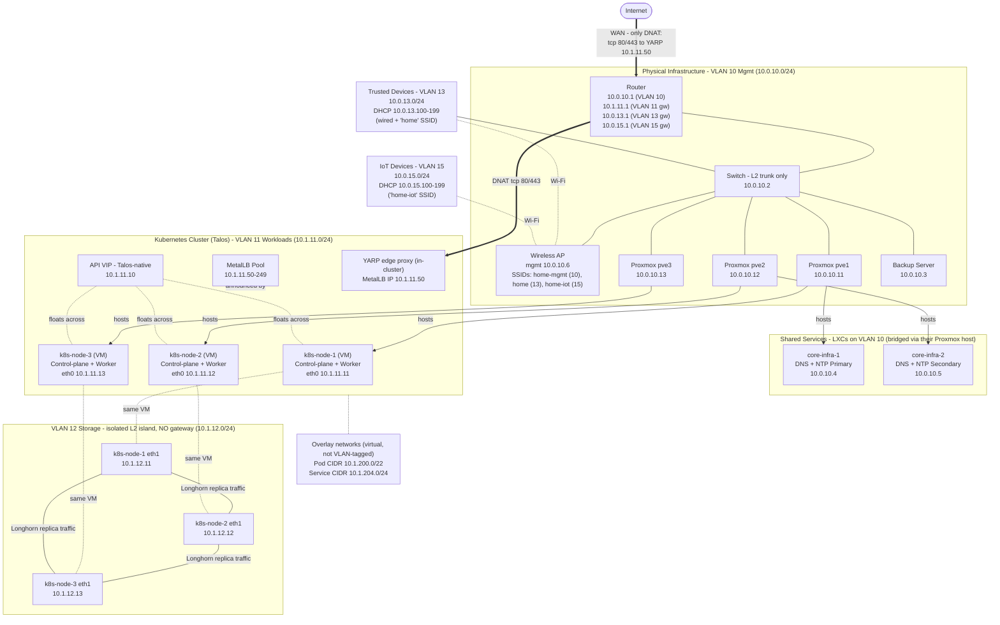

Notes:

- The DNS/NTP LXCs have no cable of their own - they reach the switch through their
  Proxmox host's bridge.
- The sole WAN port-forward is tcp 80/443 DNAT to YARP's pinned MetalLB IP (10.1.11.50);
  YARP runs inside the cluster. Edge design and blast-radius analysis in
  `wifi_and_isolation.md`.
- Wi-Fi carries VLANs 10, 13, 15 (one SSID each); VLANs 11/12 are wired-only. SSID mapping
  and AP config in `wifi_and_isolation.md`.
- VLAN 12 has **no router sub-interface**: Longhorn traffic never leaves the L2 segment, and
  nothing outside it can route in. Node eth1 interfaces carry an IP + netmask only (no
  gateway). Recommended MTU 9000 on this VLAN only - see `allocations.md` design notes.
- Router gateway ownership per VLAN is deliberately not drawn as edges here to keep the
  diagram readable; `allocations.md` is the source of truth.
- Full traffic policy (who may talk to whom) lives in `firewall_rules.yaml`.
