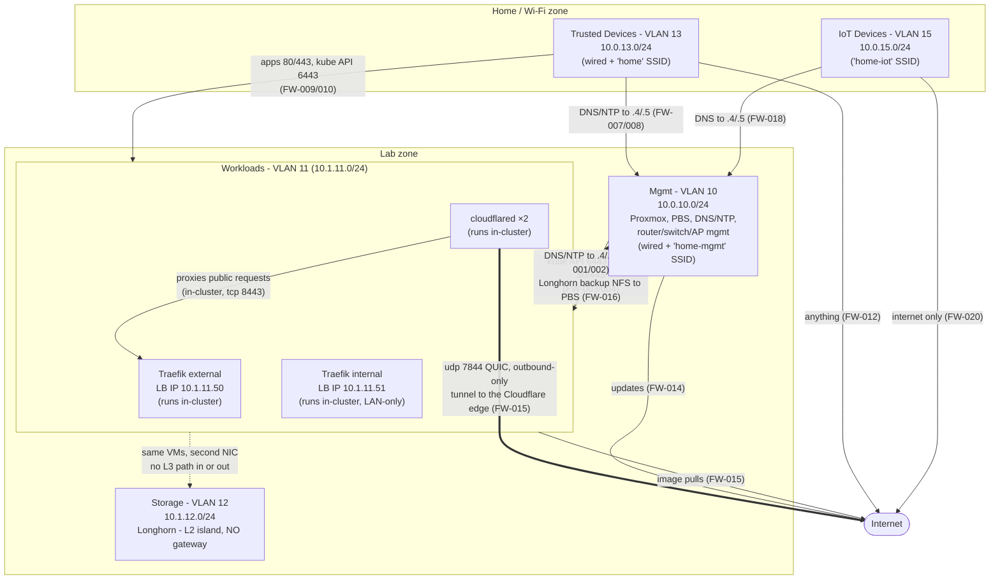
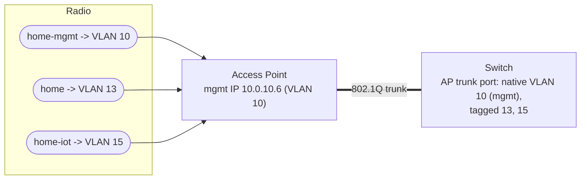
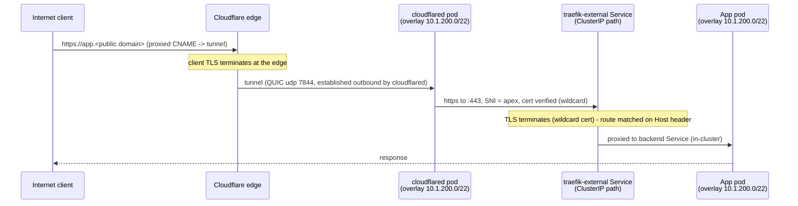

# Wi-Fi, Trust Zones, and the Public Edge (Traefik)

Covers what `allocations.md` and `firewall_rules.yaml` only imply: the Wi-Fi/SSID layout,
the trust-zone model, and how the publicly exposed Traefik edge is contained.
`allocations.md` remains the source of truth for addresses; `firewall_rules.yaml` for the
exact rule set.

---

## 1. Trust Zones

Arrows are the only permitted initiated flows (stateful firewall - return traffic implied).
Anything not drawn is denied by default-deny (FW-900) or has no L3 path at all.

Zone summary:

- **Lab is invisible from the home zone** except the doors from VLAN 13: published apps,
  kube API, and DNS/NTP. FW-011 denies everything else private.
- **IoT reaches internal DNS and the internet, nothing else** - no path to published apps,
  the kube API, the mgmt VLAN, or trusted devices.
- **Trust is one-way**: mgmt → workloads is allowed; workloads → mgmt is DNS/NTP only.
- **The router accepts zero inbound WAN connections**: the public edge is an outbound-only
  Cloudflare Tunnel - cloudflared (in-cluster) dials the Cloudflare edge and proxies to the
  external Traefik instance. FW-017 documents the DNAT fallback, materialised only when
  `edge_mode = "dnat"`. The internal instance (10.1.11.51) is never exposed - unreachable
  from the internet by topology.

---

## 2. Wi-Fi

VLANs 11 (workloads) and 12 (storage) are wired-only - no SSID maps to them. Three SSIDs:

| SSID | VLAN | Security | Purpose |
|---|---|---|---|
| `home` | 13 (Trusted) | WPA3-SAE (WPA2/3 transition if needed) | Personal laptops/phones; same policy as wired trusted devices |
| `home-iot` | 15 (IoT) | WPA2-PSK, separate passphrase, 2.4 GHz | Smart-home devices. AP client isolation ON |
| `home-mgmt` | 10 (Mgmt) | WPA3-SAE, separate passphrase | Wireless administration: Proxmox/PBS UIs, SSH, kubectl. Joining this SSID = full mgmt access, so the passphrase is treated like an admin credential |

AP configuration:

- Trunk port to the AP carries VLAN 10 native (untagged) plus tagged VLANs 13 and 15.
  AP management itself sits on VLAN 10 at `10.0.10.6`, reachable only from the mgmt
  network. Native-mgmt keeps adoption and factory-reset recovery working without port
  reconfiguration (see `physical_network.md`).
- WPS and legacy WPA/TKIP disabled on all SSIDs.
- Client isolation: ON for `home-iot`, OFF for `home` and `home-mgmt`.
- mDNS/casting does not cross VLANs; devices that must be castable from phones live on
  VLAN 13.
- Guest access, if added later, is a fourth SSID on its own internet-only VLAN.

---

## 3. Kubernetes ⇸ Proxmox Isolation

The cluster runs *on* the hypervisors but is a network tenant, not a peer. Enforced
independently at three layers:

| Layer | Mechanism | Effect |
|---|---|---|
| Router (L3) | Only VLAN 11 → VLAN 10 allows are DNS/NTP to `10.0.10.4/.5` (FW-001/002) and Longhorn backup NFS from the node IPs to PBS (FW-016); FW-900 denies the rest | Nodes/pods cannot reach Proxmox UI (8006), SSH (22), PBS UI/API (8007), router or switch |
| Proxmox host firewall | PVE-FW-008 denies VLAN 11 → pve hosts + PBS (sole exception: the FW-016 backup path, allowed by PVE-FW-007) | Same block holds even if a router ACL regresses |
| Structural (L2) | VLAN 12 has no router sub-interface | Storage network unroutable from anywhere, in either direction |

Direction is one-way: mgmt administers the cluster (FW-003/004); the cluster never initiates
toward mgmt beyond DNS/NTP and the Longhorn backup push to PBS. DNS/NTP land on unprivileged
LXCs guarded by their own vNIC rules (LXC-FW-*), not on the hypervisors; the backup path is
pinned to node-IP → PBS tcp 2049 only.

Residual risk: a hypervisor escape from a k8s VM bypasses all network controls. Mitigation
is operational - patched Proxmox, virtio-only devices (no passthrough), PBS backups for
fast host rebuild.

---

## 4. Public Edge: Traefik In-Cluster

Two Traefik instances run as Deployments inside the cluster (`terraform/40-kube-networking`), each
exposed via a `LoadBalancer` Service with an IP from the Cilium LB pool:

| Instance | LB IP | ingressClass | Exposure |
|---|---|---|---|
| `traefik-external` | 10.1.11.50 | `traefik-external` | Cloudflare Tunnel origin (dnat fallback: FW-017) |
| `traefik-internal` | 10.1.11.51 | `traefik-internal` | LAN only - never exposed |

An app chooses its exposure by the ingressClass it publishes under. Internal-only apps are
unreachable from the internet by topology - no DNAT to `10.1.11.51` exists - not by
per-route configuration.

Public traffic enters via a Cloudflare Tunnel (`terraform/50-cloudflare`). TLS from the
client terminates at Cloudflare's edge and is re-encrypted over the tunnel to cloudflared:
two in-cluster replicas (one per node) that dial OUT to the Cloudflare edge over QUIC
(udp 7844, FW-015) and proxy requests to the external Traefik Service with SNI pinned to
the apex (`originServerName`) and full certificate verification - the router forwards no
WAN ports at all. A single `edge_mode` ("tunnel" | "dnat"), owned by 10-network's tfvars
and read by 50-cloudflare via remote state, selects the edge: dnat mode restores the
legacy WAN DNAT tcp 80/443 → `10.1.11.50` (FW-017) and removes the Terraform-managed
public DNS records. Flip it in 10-network, then apply 10-network followed by 50-cloudflare.

TLS at Traefik uses a wildcard certificate for the owned public domain (`home.arpa` cannot
get a public cert), issued by cert-manager via ACME DNS-01 against the domain's DNS host
(Cloudflare) - issuance never depends on inbound traffic, and per-host names stay out of
individual certificate-transparency entries. The external instance trusts client-IP
headers (`CF-Connecting-IP` / `X-Forwarded-For`) only from the Cloudflare edge ranges and
the pod CIDR (the cloudflared pod is its direct peer); the internal instance trusts none.

DNS is split-horizon: Technitium hosts an internal zone for the public domain with a
wildcard record → `10.1.11.50` and explicit records → `10.1.11.51` for internal-only
hostnames (more-specific beats wildcard). Public DNS (Cloudflare) carries two
Terraform-managed proxied records in tunnel mode - apex and wildcard CNAMEs →
`<tunnel-id>.cfargotunnel.com` (50-cloudflare); in dnat mode public records are manual
(the WAN IP is never committed). LAN clients therefore hit the same hostnames and the
same Traefik routes as internet clients, without hairpinning through the WAN or the
tunnel.

LAN clients skip the first hop: split-horizon DNS resolves the hostname straight to the
LB IP and the same route matching applies.

### Containment

Because the public entry point shares VLAN 11 with the cluster, containment is enforced at
the Kubernetes layer instead of a separate VLAN:

- Each Traefik instance runs in its own namespace behind a default-deny `NetworkPolicy`,
  enforced by Cilium: inbound only on the entry points (8000/8443); egress only to cluster
  DNS, the kube API, and the pod network it proxies. No internet egress exists - ACME is
  handled by cert-manager, so Traefik itself never talks out.
- The pods run non-root. Traefik requires a ServiceAccount token (it watches Ingress,
  IngressRoute, Service, Endpoint, and TLS Secret objects); the token is RBAC-scoped to
  read-only on those types - no write verbs, no pod exec, no node access.
- cloudflared runs in its own namespace behind the same default-deny pattern: no ingress
  at all (the tunnel is outbound-only); egress only to cluster DNS, the Cloudflare edge
  (udp 7844 / tcp 443, public internet only - RFC1918 excluded), and the external Traefik
  entry point (tcp 8443). Non-root, read-only rootfs, no ServiceAccount permissions.
- Nothing on the WAN is forwarded in tunnel mode; in dnat mode, only FW-017 - never SSH,
  the kube API, or the Proxmox UI.

### Blast radius (compromised Traefik pod)

| Target | Reachable? | Limited by |
|---|---|---|
| In-cluster pods (published apps) | Yes - proxying them is its job | Egress NetworkPolicy allows the pod network (10.1.200.0/22) only |
| kube API | Read-only | RBAC-scoped ServiceAccount: watch/list on routing objects and TLS Secrets; no writes |
| Proxmox / PBS / VLAN 10 | No | Egress NetworkPolicy (VLAN 10 not in the allowed set - the Longhorn backup path FW-016 included) + router default-deny + PVE-FW-008 |
| Longhorn / VLAN 12 | No | No L3 path exists |
| Home VLANs 13 / 15 | No | No VLAN 11 → 13/15 allow exists |
| Internet (exfil/C2) | No | Egress NetworkPolicy permits only DNS, kube API, and the pod network; FW-015 (tcp 80/443 out) never comes into play |

### Blast radius (compromised cloudflared pod)

| Target | Reachable? | Limited by |
|---|---|---|
| Traefik external entry points | Yes - proxying to them is its job | Egress NetworkPolicy allows the traefik-external namespace on tcp 8443 only |
| Cloudflare edge / internet | udp 7844 + tcp 443 only | Egress NetworkPolicy excludes all RFC1918; FW-015 allows nothing else outbound |
| Other pods, kube API, Longhorn, VLAN 10/13/15 | No | Egress NetworkPolicy (no pod-network or kube-API allow), router default-deny, no L3 path to VLAN 12 |

Trade-off accepted with this design: a container escape onto a k8s node lands the attacker
on VLAN 11 itself, where the section 3 controls are the remaining boundary. A dedicated
proxy VM in its own DMZ VLAN would remove that step at the cost of an extra VM and VLAN;
in-cluster was chosen instead to keep the design simple.
