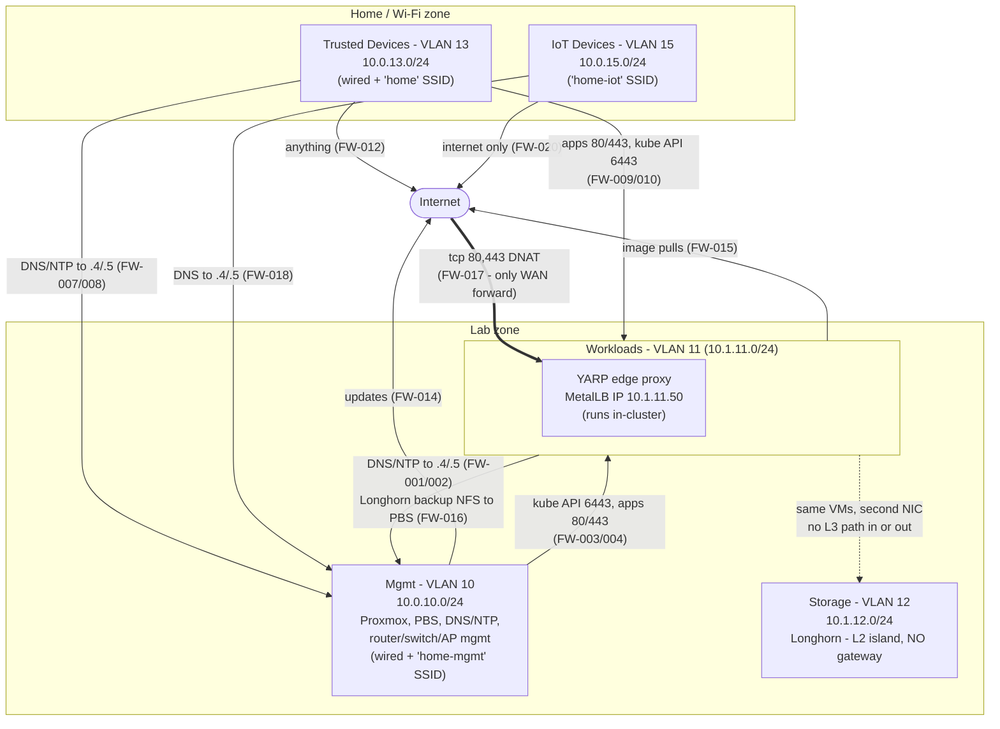
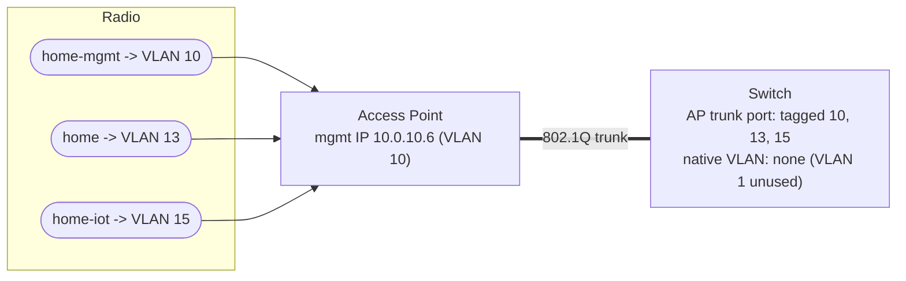
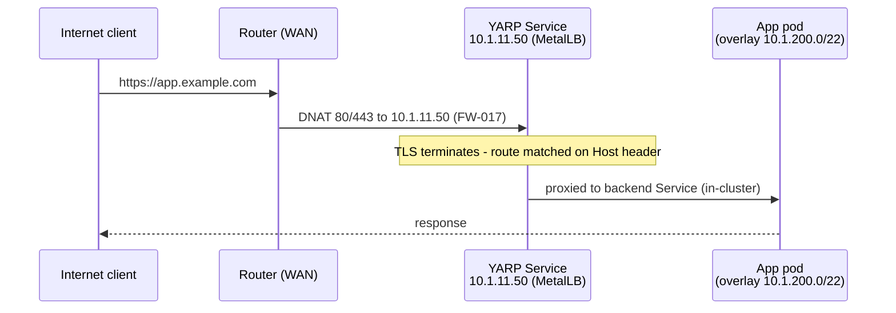

# Wi-Fi, Trust Zones, and the Public Edge (YARP)

Covers what `allocations.md` and `firewall_rules.yaml` only imply: the Wi-Fi/SSID layout,
the trust-zone model, and how the publicly exposed YARP proxy is contained.
`allocations.md` remains the source of truth for addresses; `firewall_rules.yaml` for the
exact rule set.

---

## 1. Trust Zones

Arrows are the only permitted initiated flows (stateful firewall - return traffic implied).
Anything not drawn is denied by default-deny (FW-900) or has no L3 path at all.

Zone summary:

- **Lab is invisible from the home zone** except the doors from VLAN 13: published apps,
  kube API, and DNS/NTP. FW-011 denies everything else private.
- **IoT reaches internal DNS and the internet, nothing else** - no path to published apps,
  the kube API, the mgmt VLAN, or trusted devices.
- **Trust is one-way**: mgmt → workloads is allowed; workloads → mgmt is DNS/NTP only.
- **The only WAN entry is the DNAT to YARP's MetalLB IP** (FW-017).

---

## 2. Wi-Fi

VLANs 11 (workloads) and 12 (storage) are wired-only - no SSID maps to them. Three SSIDs:

| SSID | VLAN | Security | Purpose |
|---|---|---|---|
| `home` | 13 (Trusted) | WPA3-SAE (WPA2/3 transition if needed) | Personal laptops/phones; same policy as wired trusted devices |
| `home-iot` | 15 (IoT) | WPA2-PSK, separate passphrase, 2.4 GHz | Smart-home devices. AP client isolation ON |
| `home-mgmt` | 10 (Mgmt) | WPA3-SAE, separate passphrase | Wireless administration: Proxmox/PBS UIs, SSH, kubectl. Joining this SSID = full mgmt access, so the passphrase is treated like an admin credential |

AP configuration:

- Trunk port to the AP carries tagged VLANs 10, 13, 15. AP management itself sits on
  VLAN 10 at `10.0.10.6`, reachable only from the mgmt network.
- WPS and legacy WPA/TKIP disabled on all SSIDs.
- Client isolation: ON for `home-iot`, OFF for `home` and `home-mgmt`.
- mDNS/casting does not cross VLANs; devices that must be castable from phones live on
  VLAN 13.
- Guest access, if added later, is a fourth SSID on its own internet-only VLAN.

---

## 3. Kubernetes ⇸ Proxmox Isolation

The cluster runs *on* the hypervisors but is a network tenant, not a peer. Enforced
independently at three layers:

| Layer | Mechanism | Effect |
|---|---|---|
| Router (L3) | Only VLAN 11 → VLAN 10 allows are DNS/NTP to `10.0.10.4/.5` (FW-001/002) and Longhorn backup NFS from the node IPs to PBS (FW-016); FW-900 denies the rest | Nodes/pods cannot reach Proxmox UI (8006), SSH (22), PBS UI/API (8007), router or switch |
| Proxmox host firewall | PVE-FW-008 denies VLAN 11 → pve hosts + PBS (sole exception: the FW-016 backup path, allowed by PVE-FW-007) | Same block holds even if a router ACL regresses |
| Structural (L2) | VLAN 12 has no router sub-interface | Storage network unroutable from anywhere, in either direction |

Direction is one-way: mgmt administers the cluster (FW-003/004); the cluster never initiates
toward mgmt beyond DNS/NTP and the Longhorn backup push to PBS. DNS/NTP land on unprivileged
LXCs guarded by their own vNIC rules (LXC-FW-*), not on the hypervisors; the backup path is
pinned to node-IP → PBS tcp 2049 only.

Residual risk: a hypervisor escape from a k8s VM bypasses all network controls. Mitigation
is operational - patched Proxmox, virtio-only devices (no passthrough), PBS backups for
fast host rebuild.

---

## 4. Public Edge: YARP In-Cluster

YARP runs as a Deployment inside the cluster, exposed via a `LoadBalancer` Service pinned
to MetalLB IP `10.1.11.50`. The router's only WAN port-forward is tcp 80/443 → `10.1.11.50`
(FW-017); 80 exists for ACME HTTP-01 and the HTTPS redirect. TLS terminates at YARP with a
real owned domain (`home.arpa` cannot get a public cert).

### Containment

Because the public entry point shares VLAN 11 with the cluster, containment is enforced at
the Kubernetes layer instead of a separate VLAN:

- YARP runs in its own namespace with a default-deny `NetworkPolicy`; egress is opened only
  to the namespaces/ports of published apps (plus ACME on 443).
- The pod runs non-root with no ServiceAccount token automounted - a compromised pod holds
  no kube API credentials.
- Nothing else on the WAN is forwarded: no SSH, no kube API, no Proxmox UI.

### Blast radius (compromised YARP pod)

| Target | Reachable? | Limited by |
|---|---|---|
| Published app pods | Yes - proxying them is its job | Same surface the internet already had |
| Other pods / kube API | No | NetworkPolicy + no ServiceAccount token |
| Proxmox / PBS / VLAN 10 | No | Router default-deny + PVE-FW-008; the Longhorn backup allow (FW-016, node IPs → PBS tcp 2049) is closed to YARP by its egress NetworkPolicy |
| Longhorn / VLAN 12 | No | No L3 path exists |
| Home VLANs 13 / 15 | No | No VLAN 11 → 13/15 allow exists |
| Internet (exfil/C2) | tcp 80/443 only | FW-015 |

Trade-off accepted with this design: a container escape onto a k8s node lands the attacker
on VLAN 11 itself, where the section 3 controls are the remaining boundary. A dedicated
proxy VM in its own DMZ VLAN would remove that step at the cost of an extra VM and VLAN;
in-cluster was chosen instead to keep the design simple.
